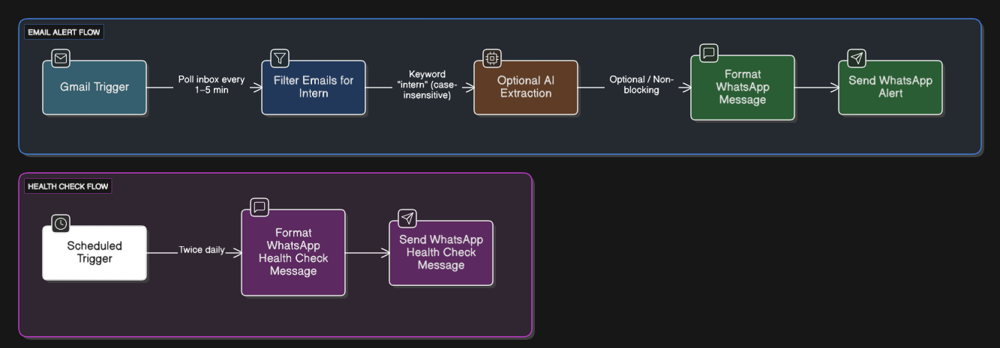
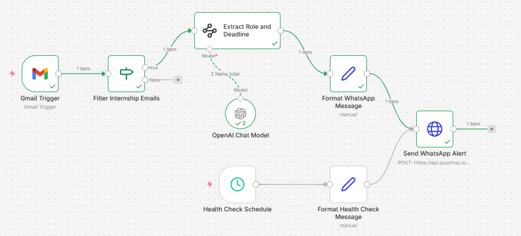

# Gmail Internship Alert → WhatsApp Notifier (n8n)

**Have you ever missed an internship opportunity just because you didn’t check your email on time?**
If yes, this project solves exactly that problem.

This automation continuously monitors your Gmail inbox for internship-related emails and instantly sends a WhatsApp notification, ensuring you never miss time-sensitive opportunities.

The system is designed to be **free-tier friendly**, reliable, and simple enough to maintain without complex infrastructure.

---

## What This Project Does

* Monitors Gmail automatically at a fixed interval (1–5 minutes)
* Detects internship-related emails using keyword matching
* Sends one WhatsApp alert per matching email
* Includes email received time and subject
* Optionally extracts role and deadline using AI (with safe fallback)
* Sends scheduled health-check messages to ensure reliability
* Runs 24/7 on n8n Cloud, even when your laptop is turned off

---

## How It Works

High-level workflow:

```
Gmail Inbox
  → Gmail Trigger (n8n)
  → Internship Keyword Filter
  → Optional AI Extraction (role, deadline)
  → Message Formatter
  → WhatsApp Alert (Gupshup Sandbox)
```


[](screenshots/workflow-overview.png)

A **separate scheduled workflow** sends daily health-check messages to confirm that WhatsApp delivery is working and to avoid sandbox inactivity issues.

[](screenshots/workflow-overview.png)


## Technologies Used

* n8n Cloud (free tier)
* Gmail Trigger (OAuth)
* Gupshup WhatsApp Sandbox
* OpenAI gpt-4o-mini (optional, free credits)

---


## Repository Structure

```

├── README.md
├── workflow/
│   └── Gmail Internship Alert to WhatsApp Notifier.json
├── screenshots/
│   ├── workflow-overview.png
│   └── whatsapp-alert.png
└── examples/
    └── test-emails.md
```

## Who This Project Is For

* Students tracking internship opportunities
* Beginners learning workflow automation
* Users who want WhatsApp alerts without paid tools
* Engineers exploring practical n8n use cases

---

## Future Improvements (Optional)

* Full email body parsing (paid Gmail API)
* Database-backed daily summaries
* Production WhatsApp Business API
* Role categorization and prioritization
* Company name normalization


<details>
<summary><strong>Limitations</strong></summary>

## Why This Project Is Free (and Its Limitations)

This project is intentionally built using **free services**, which introduces some expected limitations.

### Known Limitations

* Full email body is **not processed**
* Only the Gmail **snippet** (short preview text) is analyzed
* Company name is not always detectable (many emails are forwarded by universities)
* AI credits are limited and may expire
* WhatsApp sandbox may temporarily deactivate after inactivity
* No persistent database is used for long-term storage

These trade-offs were chosen to keep the system **cost-free, stable, and easy to maintain**.


</details>
<details>
<summary><strong>More</strong></summary>

<br>

---

## Why Only the Email Snippet Is Used

* Gmail provides a short preview (snippet) by default
* Avoids complex MIME parsing
* Faster and safer for free-tier usage
* Enough to detect internship intent, role, and early deadlines

This design prioritizes **reliability over completeness**.

---

## AI Extraction (Optional and Non-Blocking)

* Uses OpenAI gpt-4o-mini
* Attempts to extract:

  * Role / intent
  * Application deadline
* If AI fails:

  * Workflow continues normally
  * WhatsApp alert is still sent
  * Fallback values are used

AI is treated as an enhancement, never a dependency.

---

## Reliability Features

* Twice-daily WhatsApp health-check messages
* AI nodes configured with “continue on fail”
* No duplicate alerts
* One email results in exactly one WhatsApp message
* Credentials and triggers remain isolated and unchanged

---

## Deployment and Portability

This workflow can be exported as a JSON file and imported into:

* Self-hosted n8n
* Docker-based n8n
* Cloud VM (AWS / GCP free tier)

Credentials must be reconnected manually for security reasons.

---
</details>